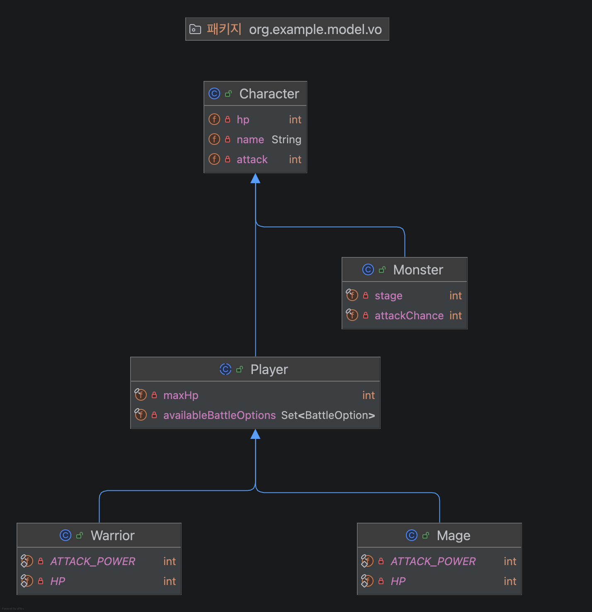

# Console RPG Game

간단한 콘솔 기반 무한 스테이지 RPG 게임입니다.

## 실행 방법

```bash
./gradlew run
```

## 주요 기능

- 전사와 마법사 중 직업 선택
- 직업별 사용 가능한 행동 분리
  - 전사: 공격, 방어
  - 마법사: 공격, 스킬
- 스테이지가 올라갈수록 강해지는 몬스터
- 몬스터의 확률적 공격
- 잘못된 입력 시 재입력 처리

## 구조

- `controller`: 게임 진행 흐름 제어
- `engine`: 전투와 스테이지 생성 규칙
- `model`: 캐릭터, 플레이어, 몬스터 도메인
- `view`: 콘솔 입력과 출력

## 클래스 다이어그램

`Character -> Player -> Warrior/Mage` 형태로 2차 상속을 사용합니다.


