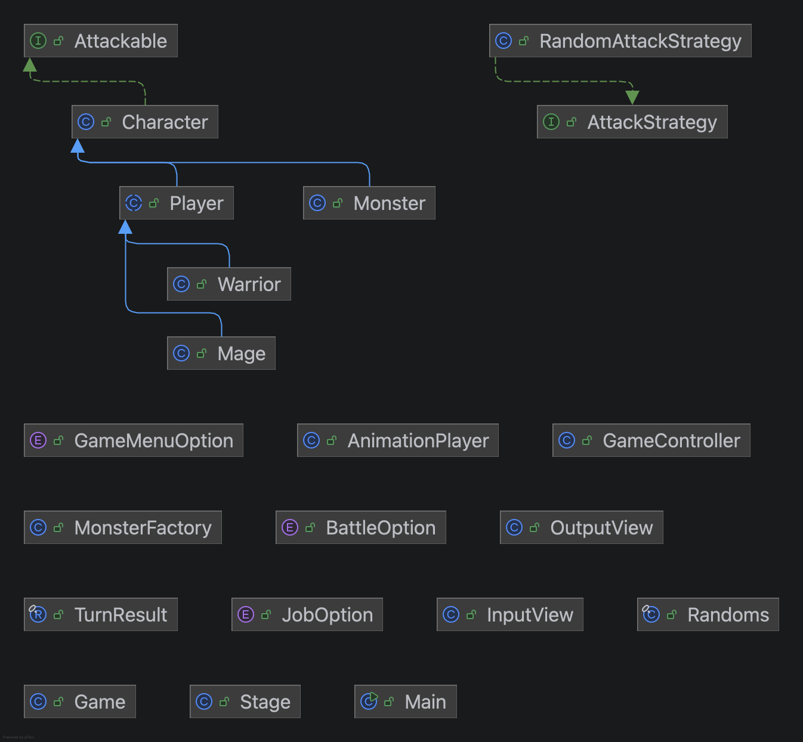

# Console RPG Game

간단한 콘솔 기반 무한 스테이지 RPG 게임입니다.

## 실행 방법

```bash
./gradlew run
```

## 주요 기능

- 전사와 마법사 중 직업 선택
- 직업별 사용 가능한 행동 분리
  - 전사: 공격, 방어
  - 마법사: 공격, 스킬
- 직업별 행동에 따른 피해량 계산
- 스테이지가 올라갈수록 강해지는 몬스터
- 별도 스레드에서 2초마다 시도하는 몬스터의 확률적 자동 공격
- 몬스터 처치 시 스테이지 클리어 및 다음 스테이지 진행
- 플레이어 체력 0 도달 시 게임 오버
- 전투 행동별 ASCII 애니메이션 출력
- 잘못된 입력 시 예외 처리

## 게임 흐름

1. 메뉴에서 게임 시작 또는 종료를 선택합니다.
2. 전사 또는 마법사 중 직업을 선택합니다.
3. 직업별 가능한 행동으로 몬스터와 전투하며, 전투 중 몬스터는 별도 스레드에서 2초마다 공격을 시도합니다.
4. 몬스터를 처치하면 스테이지를 클리어하고 다음 스테이지로 이동합니다.
5. 플레이어의 체력이 0이 되면 게임이 종료됩니다.

## 구조

- `controller`: 게임 진행 흐름 및 몬스터 자동 공격 스레드 생명주기 제어
- `dto`: 메뉴 선택, 플레이어 턴 결과, 몬스터 자동 공격 결과 데이터
- `model`: 캐릭터, 플레이어, 몬스터, 스테이지와 전투 상태 변경 도메인
- `model.vo`: 직업과 전투 행동 선택지
- `util`: 랜덤 값 생성 유틸리티
- `view`: 콘솔 입력과 출력
  - `view.in`: 사용자 입력
  - `view.out`: 전투 결과와 ASCII 애니메이션 출력

## 클래스 다이어그램


